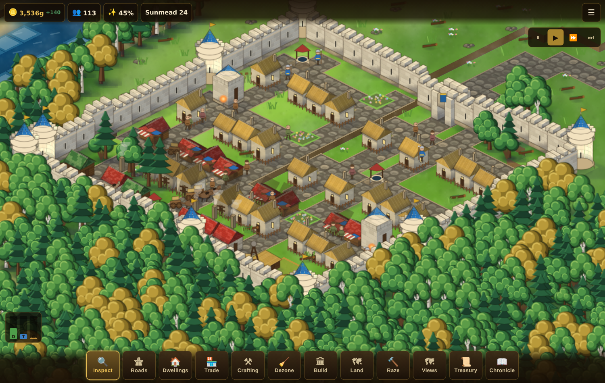

# Azeroth Skylines

A city builder in the spirit of *Cities: Skylines*, set in Elwynn Forest and
built in the visual language of Stormwind. A road runs into the valley and
stops; everything else is yours to lay out.

The whole game — code, artwork, interface — compiles to a **single shareable
`index.html` file** with no external assets, no network calls and no
dependencies at runtime. Open it from a phone, a laptop or a USB stick and
it works.



## Playing

**[Play it in your browser](https://raidandfade.github.io/AzerothSkylines/)** —
the current state of `master`, republished on every push.

To keep a copy, download `index.html` from any [Build
run](https://github.com/RaidAndFade/AzerothSkylines/actions/workflows/build.yml):
one file, which runs offline on a phone, a laptop or a USB stick. Or build it
yourself with `npm install && npm run build`.

| | |
|---|---|
| **Move the map** | One finger drag (or the mouse) while Inspect is selected; two fingers any time. With a mouse, the right or middle button drags whatever tool is held, and a two-finger trackpad scroll moves the map |
| **Zoom** | Pinch, the scroll wheel, or `Ctrl`+scroll on a trackpad |
| **Put the tool down** | Right click, or `Esc`. A second one closes the open panel |
| **Draw a street** | Pick **Roads**, then drag. Streets are laid in an L from where the drag began |
| **Footpaths** | Cheap, and the quickest way to walk — but no carts, and no water or drainage beneath them |
| **Zone land** | Pick **Dwellings**, **Trade** or **Crafting**, then drag a rectangle beside a road |
| **Build** | Pick **Build**, choose from the catalogue, then tap a plot fronting a road |
| **Annex land** | Pick **Land**, tap a lot beyond the walls, and confirm the price |
| **Clear ground** | Pick **Raze** and drag over what you want gone |
| **Keyboard** | `WASD` scroll · `Q`/`E` zoom · `1`–`4` speed · `Tab` next panel · `Esc` back out |
| **Tool keys** | `I` inspect · `R` roads · `Z` dwellings · `T` trade · `C` crafting · `B` build · `L` land · `X` raze |

Your city is saved to the browser on this device every ninety game-days, and
from the menu.

### Getting started

The game opens on a short guide, and it is in the menu thereafter. In brief:

1. Lay a street off the king's road where it enters your walls.
2. Zone dwellings along it. Buildings only grow on zoned land that fronts a
   street, so leave no plot more than one tile from the cobbles.
3. Sink a **Village Well** and dig a **Cesspit** — water and drainage run
   beneath the streets, so both reach any building whose door is on a road.
4. Zone for **Trade** so there is somewhere to buy bread, and **Crafting**
   so there is somewhere to work. Keep the forges downwind of the houses.
5. When the district fills, use **Land** to buy the next lot. The curtain
   wall moves out to enclose it and its woodland comes down; you pay for the
   land and the new masonry.

## How it works

### The valley

Terrain is generated from the name you give your valley, so the same name
always grows the same valley. Rolling hardwood country sits below northern
foothills; a lake is sunk into the valley floor and two or three streams are
walked down to it, cutting their beds as they go. The ground is then
classified by height and moisture into water, sand, grass, meadow, woodland,
rock and snow, and quantised into eight elevation steps.

The founding district is chosen **before** the town site: every possible
block of parcels is scored on how much of it is workable, level ground, and
the best one is claimed whole — and felled, since a town is not built in a
forest. (Choosing a promising tile first and claiming land around it
afterwards is how settlements end up straddling a river.) The
king's road is then A\*-routed in from the valley edge, preferring flat, dry,
open ground, and a level corridor is cut and filled along it.

### The city

| System | What it does |
|---|---|
| `sim/roads` | Placement rules, bridges, slope limits, auto-tiling connectivity, A\* pathfinding |
| `sim/zoning` | Painting districts; street-frontage rules |
| `sim/growth` | Growth ladders, upgrades and decline. Industry picks farming, timber, mining or crafting from the land around the plot |
| `sim/utilities` | Water and drainage pushed along the road network under capacity limits |
| `sim/services` | Radius coverage for the guard, the Light, merriment and commerce; pollution and land value |
| `sim/trade` | Production, haulage between buildings, hub reserves, import and export |
| `sim/population` | Who lives where, who works where, and how content they are |
| `sim/demand` | The three demand bars, driven by contentment, vacancies and unfilled posts |
| `sim/economy` | Monthly taxes and upkeep, the month in progress projected, the ledger of closed months, Crown loans, and what stops working while the city is in debt |
| `sim/walls` | The curtain wall, derived from the land you hold |
| `sim/agents` | Villagers, carts, guards and travellers. Carts keep to the streets; people on foot take the paths |

Every system is a plain function over plain state, which is why the whole
simulation can be tested without a browser.

### The artwork

There are no image files. Every building, tree, road tile, wall piece and
villager is drawn with the Canvas 2D API into an offscreen sprite the first
time it is needed, then blitted. Buildings are composed from a small set of
isometric primitives — boxes, hipped and gabled roofs, cones, cylinders —
driven by a table of styles, which is what keeps forty-odd structures
looking like one city rather than forty separate drawings.

Ground is painted as batched isometric diamonds: tiles are bucketed by class
and shade and each bucket filled in a single path, so a full screen of
Elwynn costs a few dozen draw calls while every tile still gets its own
slight variation in colour.

## Building it

```bash
npm install
npm run build      # -> dist/index.html, one self-contained file
npm run dev        # dev server on :8080 with live reload
npm test           # the simulation test suite
npm run typecheck  # strict TypeScript, no emit
npm run sheet      # -> dist/sheet.html, a contact sheet of every sprite
```

`dist/` is not kept in the repository. GitHub Actions runs the typecheck, the
linter and the tests on every push and pull request, builds the game, and
attaches `index.html` to the run; pushes to `master` deploy it to GitHub
Pages. Build locally whenever you want the file in hand — the scripts in
`tools/` expect it at `dist/index.html`.

`npm run sheet` is a development aid: it renders the whole sprite catalogue
on one page so the artwork can be reviewed side by side. `tools/` holds
scripts that drive the built game in a real browser — a full interface
playthrough, panel screenshots and a frame-pacing measurement. See
[`tools/README.md`](tools/README.md).

### Tests

The suite covers each simulation system, plus two end-to-end runs: one that
lays out a town, gives it water, drainage and a guard, and checks it grows
past five hundred residents, employs them, supplies its shops and pays its
own way; and one that neglects a town and checks it empties out.

The runner owns this. It runs the suite on every push and pull request, and
the deploy is gated on the result, so that run is the authority rather than
anything reproduced by hand. The commands are here for when you want to sit
with one particular test:

```
npm test
npm run coverage
```

### Poking at a running city

A published page exposes a small read-mostly handle for the browser console:

```js
azerothSkylines.city            // live city state
azerothSkylines.camera          // the camera
azerothSkylines.screenForTile(x, y)
```

Nothing in the game depends on it; it exists for debugging and for the
automated interface tests in `tools/`.

## Lore notes

The content follows Elwynn Forest and Stormwind as closely as a city builder
can. Dwellings climb from wattle-and-daub crofters' huts through Goldshire
half-timber to white granite under the blue slate of the capital. Industry
follows the valley's real trades: farmsteads and vineyards, the Eastvale
logging camps, the Fargodeep and Jasperlode delves, and the forges of the
Dwarven District. Services are the Stormwind City Guard, the Cathedral of
Light, the Lion's Pride Inn and the canals that bisect the city. Trade with
the world runs through markets, caravan posts for the road to Goldshire and
Westfall, and deep-water docks.

Sources consulted for the setting:
[Elwynn Forest](https://warcraft.wiki.gg/wiki/Elwynn_Forest) ·
[Stormwind City](https://warcraft.wiki.gg/wiki/Stormwind_City)

## Licence

MIT — see [LICENSE](LICENSE). Warcraft, Azeroth, Stormwind and Elwynn Forest
are trademarks of Blizzard Entertainment; this is an unaffiliated fan project.
